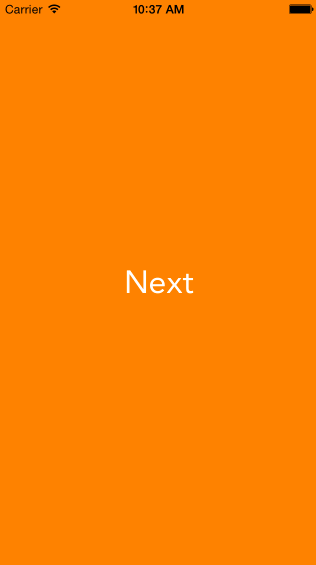

SPAnimatedTransitions
=====================

A collection of animations for UIView transitions

Usage
-------
Initialise the navigation controller as:

```SPNavigationController *navigationController = [[SPNavigationController alloc] initWithRootViewController:yourViewController];```

In the view controller

```SPNavigationController *myNavigationController = (SPNavigationController *)self.navigationController;```

```NextViewController *nextViewController = [[NextViewController alloc] init];```

Push the next view controller

```[myNavigationController pushViewController:secondViewController usingAnimation:SPTransitionAnimationStyleSpringRightToLeft];```

The animation styles (so far) are mentioned below

Some basic transforms:
-------------------------

1. SPTransitionAnimationStyleScaleOut
2. SPTransitionAnimationStyleRotateAndScaleOut

Spring animations using Facebook pop
-------------------------------------

1. SPTransitionAnimationStyleSpringExpand
2. SPTransitionAnimationStyleSpringLeftToRight
3. SPTransitionAnimationStyleSpringRightToLeft

Screenshots
------------


